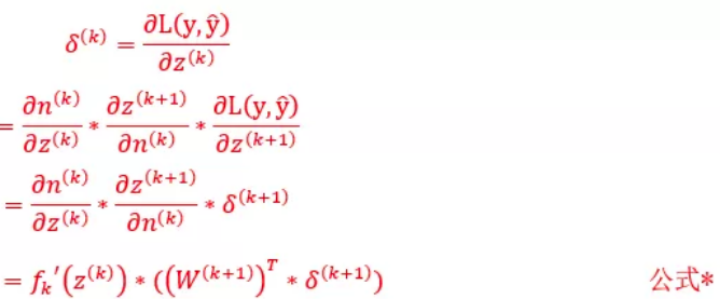
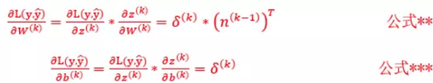
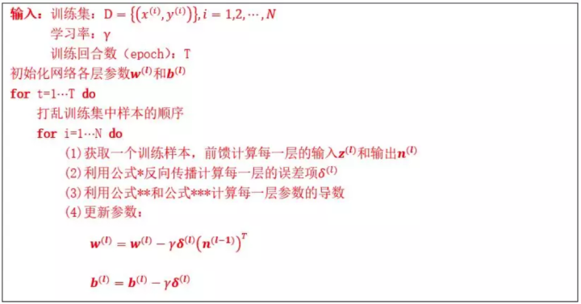

# Back Propagate Algorithm
- Reference from: [BP-Algorithm](https://github.com/INTERMT/BP-Algorithm)

## 1 Object
- Learning BP Theory by using python to Write a BP Algorithm For Fully Connected Network.

## 2 Method
- Error Item


- Parameters Derivative


- Back Propagate Algorithm


## Supplementation Material
> | A Fully Connected Network contains some layers and A layer contains some neurons. This simple Learning BP Algorithm just use to solve problem of [y1, y2, ..., ym] = f([x1, x2, ..., xn]), yi and xj value type is scalar.

## Dependencies
``` 
python 3.6

numpy
sklearn
matplotlib
```
